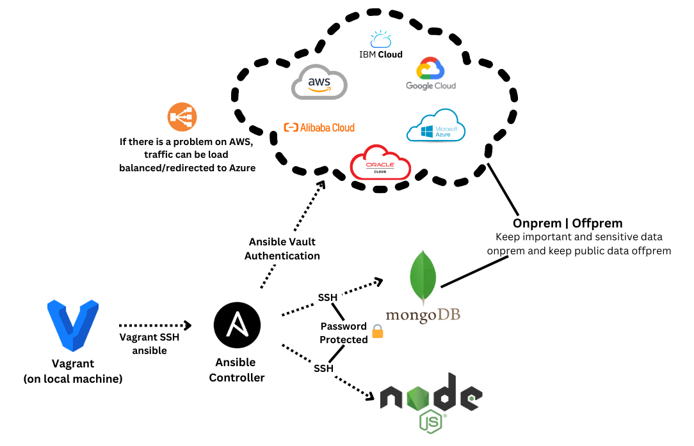

# IaC

Infrastructure as Code (IaC) is a method of managing and provisioning computing infrastructure through machine-readable definition files, rather than manual hardware configuration or interactive configuration tools.

The concept of IaC is similar to programming scripts, which are used to automate IT processes. However, the approach of IaC is to write code to define the infrastructure, hence the name. This code can then be versioned and reviewed in the same way that you would with application code.

This approach brings several advantages:

1. Speed and simplicity: With IaC, teams can quickly set up complete environments by running a script. This can drastically reduce the amount of time and effort required to get an environment ready for use.

2. Consistency: By defining your infrastructure as code, you're able to version control and review it. This means fewer mistakes and more consistency between environments, which can lead to fewer "works on my machine" issues.

3. Automation: IaC allows the automation of provisioning and changes, which can lead to faster deployments, more efficient use of resources, and less chance of human error.

4. Documentation: With infrastructure represented as code, the code itself becomes the documentation. You can see at a glance what resources are part of your infrastructure.

5. Disaster recovery: If an environment crashes, it can be quickly recreated using the code that defines it. This can significantly reduce downtime in the event of a disaster.

Common tools used in IaC include Terraform, Ansible, Chef, Puppet, and others. Each of these tools has its own language and syntax for defining infrastructure, but they all enable the management of infrastructure via code files. The choice of tool often depends on the needs and context of your specific project.

# Why ansible config management?

1. Powerful - Can control different types of servers at high quantities at the same time performing different tasks on each.

2. Simple - Only needs a few lines of code ( uses YAML)

3. Agentless - You do not need to install ansible on the node agents(servers its controlling)

>prereqs - vagrant + python -- If using AWS - boto3 needs python 3.6+

1. Launch Ansible controller from vagrant on local machine.
2. Using SSH or ansible vault authentication, ansible can connect to the agent nodes.
3. A mixture of Onprem and Offprem can be managed depending on client needs.
4. A load balancer can be used between cloud providers to ensure ultra robust service.