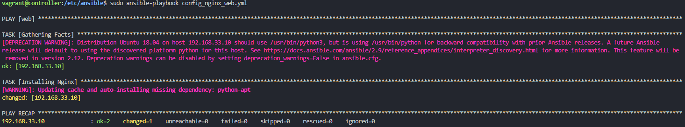
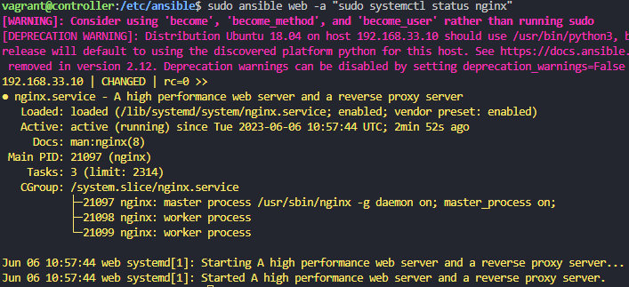
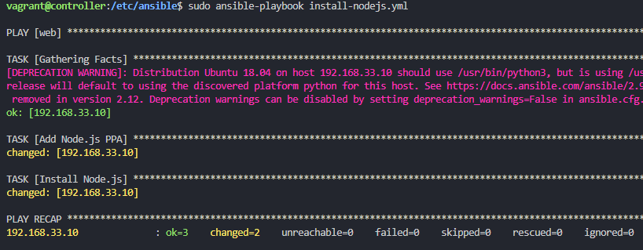
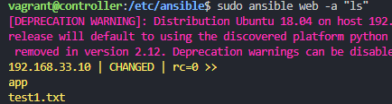
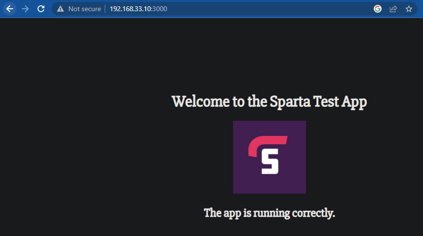
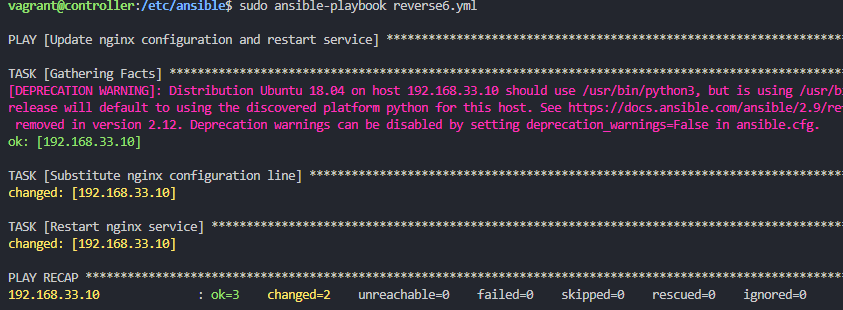
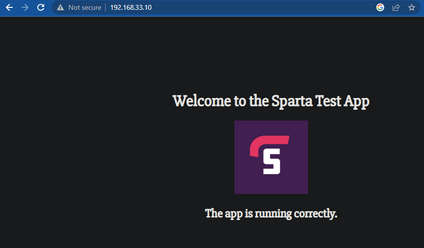

# SSH into app through controller
```bash
vagrant up
vagrant ssh controller
ssh vagrant@192.168.33.10
sudo apt-get update && sudo apt-get upgrade -y
# choose yes
# then type password 'vagrant' (it wont show but press enter)
exit
# goes back to controller
```
returns somthing similiar to :

# SSH into db through controller
```bash
# ssh into the db
ssh vagrant@192.168.33.11
sudo apt-get update && apt-get upgrade -y
# yes
# password - vagrant
exit
```
# Install Ansible and prerequisites
```bash
sudo apt install software-properties-common
sudo apt-add-repository ppa:ansible/ansible -y
sudo apt install ansible -y
sudo ansible --version
cd /etc/ansible
sudo apt install tree
# nice way to see file structure
tree
```
# Changing configs
```bash
# edits hosts file
sudo nano /etc/ansible/hosts
# add 4 lines to bottom of hosts file, so ansible knows node agents addresses and login details: 
[web]
192.168.33.10 ansible_connection=ssh ansible_ssh_user=vagrant ansible_ssh_pass=vagrant
[db]
192.168.33.11 ansible_connection=ssh ansible_ssh_user=vagrant ansible_ssh_pass=vagrant
# if you have key error "192.168.33.10 | FAILED! => {
# `   "msg": "Using a SSH password instead of a key is not possible because Host Key checking is enabled and sshpass does not support this.  Please add this host's fingerprint to your known_hosts file to manage this host."

sudo nano /etc/ansible/ansible.cfg
# scroll down and uncomment host_key_checking = false at the top of the file
# and put this just under ssh option
```


# Ping App and DB
```bash
# pings all
sudo ansible all -m ping

# if you have vault setup
sudo ansible all -m ping --ask-vault-pass

# ping app
sudo ansible web -m ping

# ping db
sudo ansible db -m ping
```
Should receive pong requests from app and db to confirm secure connection.


.
vagrant suspend
vagrant resume
vagrant reload 

- when loading into ansible make sure you are in the right directory `cd /etc/ansible` not `/home/vagrant`


```bash

sudo ansible web -a "uname -a"
sudo ansible web -a "date"
sudo ansible web -a "free -m"
sudo ansible web -a "ls -a"
sudo nano test.txt
# copy file from controller to node-agent
sudo ansible web -m copy -a "src=/etc/ansible/test1.txt dest=/home/vagrant"
sudo ansible web -a "cat test1.txt"


```

adhoc documentation : 
https://docs.ansible.com/ansible/latest/user_guide/intro_adhoc.html
 using -vvv at the end of a command gives you more information

# Installing nginx using ansible playbook (yaml)

```bash
# both extensions work
sudo nano config_nginx_web.yaml
sudo nano config_nginx_web.yml
```

```yaml
# create a playbook to install nginx in web-server/s

# let's add the 3 dashes --- to start the YAML file
---
# add the name of the host
- hosts: web

# gather facts about the steps 
  gather_facts: yes

# add admin access to this file
  become: true

# add instructions/TASKS to install nginx
  tasks:
  - name: Installing Nginx
    apt: pkg=nginx state=present

#install nginx and enable nginx - ensure status is running
```


```bash

sudo ansible-playbook config_nginx_web.yml

if runs correctly
# can visit on http://192.168.33.10/ to see if nginx is up or

sudo ansible web -a "sudo systemctl status nginx"
```



# Installing nodejs
```bash
sudo nano install-nodejs.yml
```

```yaml
---
- hosts: web
  become: yes
  tasks:
    - name: Add Node.js PPA
      shell: "curl -sL https://deb.nodesource.com/setup_12.x | sudo -E bash -"
      args:
        warn: no

    - name: Install Node.js
      apt:
        name: nodejs
        update_cache: yes
        state: present
    - name: Install npm
      apt:
        name: npm
        state: present

```


```bash
sudo ansible-playbook install-nodejs.yml

# check if installed correctly
sudo ansible web -a "node -v"
```

# Getting app file from github to ansible controller

```bash
sudo apt-get update
sudo apt-get install git
sudo git clone https://github.com/basil-kh/app.git
```

# Copying app folder to target machine (web)

```bash
sudo ansible web -m copy -a "src=/etc/ansible/app dest=/home/vagrant"
sudo ansible web -a "ls"
```



# Starting the app

cd into app and npm install and npm start

```yaml
- name: Ensure app is setup and running
  hosts: 192.168.33.10
  become: yes
  tasks:
    - name: Install npm packages
      command:
        cmd: npm install
        chdir: /home/vagrant/app
      become: yes
      become_user: vagrant

    - name: Start the npm application
      shell:
        cmd: nohup npm start > /dev/null 2>&1 &
        chdir: /home/vagrant/app
      become: yes
      become_user: vagrant
```

Can check if its working by visiting http://192.168.33.10:3000/

# Setting up reverse proxy:

If so we can now implement the reverse proxy
we want to change the line `try_files $uri $uri/ =404;` to `proxy_pass http://localhost:3000/;`

```
sudo reverse-proxy.yml
```

add the following yaml code

```yaml
- name: Update nginx configuration and restart service
  hosts: 192.168.33.10
  become: yes
  tasks:
    - name: Substitute nginx configuration line
      replace:
        path: /etc/nginx/sites-available/default
        regexp: 'try_files \$uri \$uri/ =404;'
        replace: 'proxy_pass http://localhost:3000/;'
    - name: Restart nginx service
      service:
        name: nginx
        state: restarted
```

```bash
sudo ansible-playbook reverse-proxy.yml
```



Collecting all the steps into a single yaml file : 

```yaml
- hosts: web
  gather_facts: yes
  become: true
  tasks:
    - name: Installing Nginx
      apt: 
        pkg: nginx 
        state: present

    - name: Add Node.js PPA
      shell: "curl -sL https://deb.nodesource.com/setup_12.x | sudo -E bash -"
      args:
        warn: no

    - name: Install Node.js
      apt:
        name: nodejs
        update_cache: yes
        state: present

    - name: Install npm
      apt:
        name: npm
        state: present

    - name: Install npm packages
      command:
        cmd: npm install
        chdir: /home/vagrant/app
      become_user: vagrant

    - name: Start the npm application
      shell:
        cmd: nohup npm start > /dev/null 2>&1 &
        chdir: /home/vagrant/app
      become_user: vagrant

    - name: Substitute nginx configuration line
      replace:
        path: /etc/nginx/sites-available/default
        regexp: 'try_files \$uri \$uri/ =404;'
        replace: 'proxy_pass http://localhost:3000/;'

    - name: Restart nginx service
      service:
        name: nginx
        state: restarted

```