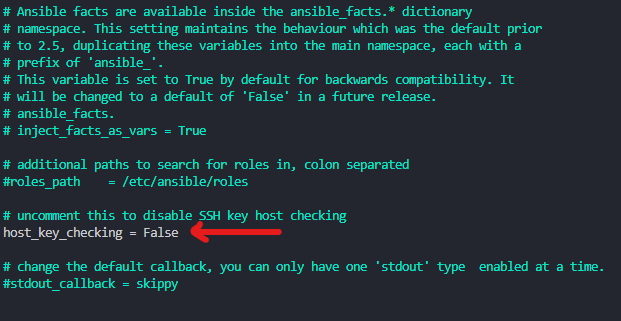
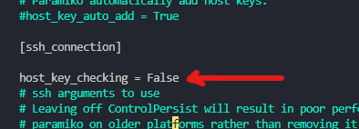
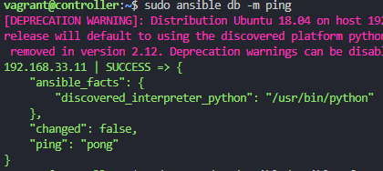
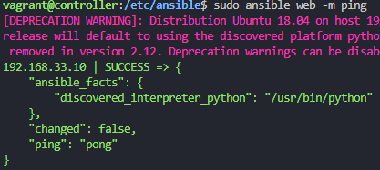

# SSH into app through controller
```bash
vagrant up
vagrant ssh controller
vagrant ssh 192.168.33.10
# choose yes
# then type password 'vagrant' (it wont show but press enter)
exit
# goes back to controller
```
returns somthing similiar to :

# SSH into db through controller
```bash
# ssh into the db
vagrant ssh 192.168.33.11
# yes
# password - vagrant
exit
```
# Install Ansible and prerequisites
```bash
sudo apt install software-properties-common
sudo apt-add-repository ppa:ansible/ansible -y
sudo apt install ansible -y
sudo ansible --version
cd /etc/ansible
sudo apt install tree
# nice way to see file structure
tree
```
# Changing configs
```bash
# edits hosts file
sudo nano /etc/ansible/hosts
# add 4 lines to bottom of hosts file: 
[web]
192.168.33.10 ansible_connection=ssh ansible_ssh_user=vagrant ansible_ssh_pass=vagrant
[db]
192.168.33.11 ansible_connection=ssh ansible_ssh_user=vagrant ansible_ssh_pass=vagrant
# if you have key error "192.168.33.10 | FAILED! => {
# `   "msg": "Using a SSH password instead of a key is not possible because Host Key checking is enabled and sshpass does not support this.  Please add this host's fingerprint to your known_hosts file to manage this host."

sudo nano /etc/ansible/ansible.cfg
# scroll down and uncomment host_key_checking = false at the top of the file
# and put this just under ssh option
```



# Ping App and DB
```bash
# pings all
sudo ansible all -m ping

# if you have vault setup
sudo ansible all -m ping --ask-vault-pass

# ping app
sudo ansible web -m ping

# ping db
sudo ansible db -m ping
```
Should receive pong requests from app and db to confirm secure connection.

