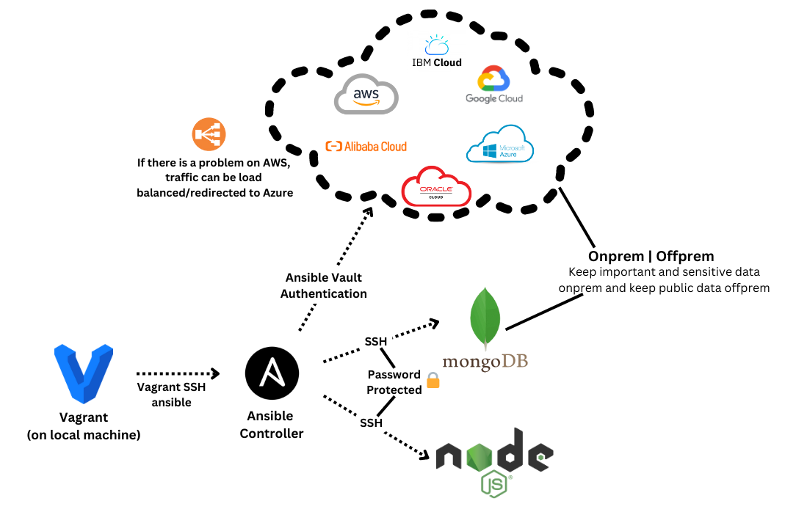
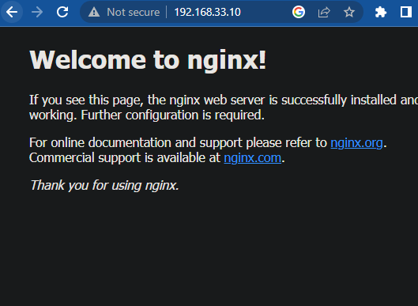
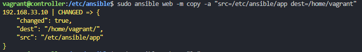
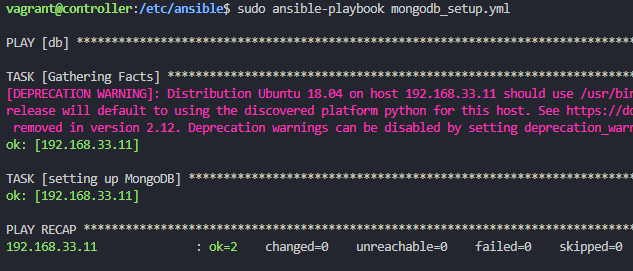
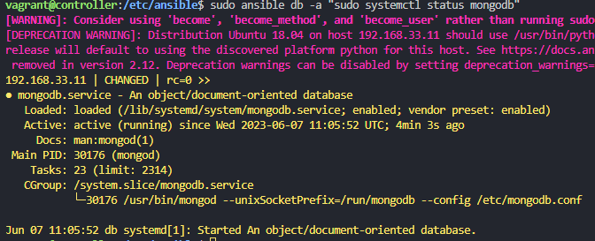

# SSH into app through controller
```bash
vagrant up
vagrant ssh controller
ssh vagrant@192.168.33.10
sudo apt-get update && sudo apt-get upgrade -y
# choose yes
# then type password 'vagrant' (it wont show but press enter)
exit
# goes back to controller
```
returns somthing similiar to :

# SSH into db through controller
```bash
# ssh into the db
ssh vagrant@192.168.33.11
sudo apt-get update && apt-get upgrade -y
# yes
# password - vagrant
exit
```
# Install Ansible and prerequisites
```bash
sudo apt install software-properties-common
sudo apt-add-repository ppa:ansible/ansible -y
sudo apt install ansible -y
sudo ansible --version
cd /etc/ansible
sudo apt install tree
# nice way to see file structure
tree
```
# Changing configs
```bash
# edits hosts file
sudo nano /etc/ansible/hosts
# add 4 lines to bottom of hosts file, so ansible knows node agents addresses and login details: 
[web]
192.168.33.10 ansible_connection=ssh ansible_ssh_user=vagrant ansible_ssh_pass=vagrant
[db]
192.168.33.11 ansible_connection=ssh ansible_ssh_user=vagrant ansible_ssh_pass=vagrant
# if you have key error "192.168.33.10 | FAILED! => {
# `   "msg": "Using a SSH password instead of a key is not possible because Host Key checking is enabled and sshpass does not support this.  Please add this host's fingerprint to your known_hosts file to manage this host."

sudo nano /etc/ansible/ansible.cfg
# scroll down and uncomment host_key_checking = false at the top of the file
# and put this just under ssh option
```


# Ping App and DB
```bash
# pings all
sudo ansible all -m ping

# if you have vault setup
sudo ansible all -m ping --ask-vault-pass

# ping app
sudo ansible web -m ping

# ping db
sudo ansible db -m ping
```
Should receive pong requests from app and db to confirm secure connection.


>If you want to pause your VMs you can use the following commands:
```
vagrant suspend
vagrant resume
vagrant reload 
```
- when loading into ansible make sure you are in the right directory `cd /etc/ansible` not `/home/vagrant`


```bash

sudo ansible web -a "uname -a"
sudo ansible web -a "date"
sudo ansible web -a "free -m"
sudo ansible web -a "ls -a"
sudo nano test.txt
# copy file from controller to node-agent
sudo ansible web -m copy -a "src=/etc/ansible/test1.txt dest=/home/vagrant"
sudo ansible web -a "cat test1.txt"


```

adhoc documentation : 
https://docs.ansible.com/ansible/latest/user_guide/intro_adhoc.html
 using -vvv at the end of a command gives you more information

# Installing nginx using ansible playbook (yaml)

```bash
# both extensions work
sudo nano config_nginx_web.yaml
sudo nano config_nginx_web.yml
```

```yaml
# create a playbook to install nginx in web-server/s

# let's add the 3 dashes --- to start the YAML file
---
# add the name of the host
- hosts: web

# gather facts about the steps 
  gather_facts: yes

# add admin access to this file
  become: true

# add instructions/TASKS to install nginx
  tasks:
  - name: Installing Nginx
    apt: pkg=nginx state=present

#install nginx and enable nginx - ensure status is running
```


```bash

sudo ansible-playbook config_nginx_web.yml

if runs correctly
# can visit on http://192.168.33.10/ to see if nginx is up or

sudo ansible web -a "sudo systemctl status nginx"
```



# Installing nodejs
```bash
sudo nano install-nodejs.yml
```

```yaml
---
- hosts: web
  become: yes
  tasks:
    - name: Add Node.js PPA
      shell: "curl -sL https://deb.nodesource.com/setup_12.x | sudo -E bash -"
      args:
        warn: no

    - name: Install Node.js
      apt:
        name: nodejs
        update_cache: yes
        state: present
    - name: Install npm
      apt:
        name: npm
        state: present

```


```bash
sudo ansible-playbook install-nodejs.yml

# check if installed correctly
sudo ansible web -a "node -v"
```

# Getting app file from github to ansible controller

```bash
sudo apt-get update
sudo apt-get install git
sudo git clone https://github.com/basil-kh/app.git
```

# Copying app folder to target machine (web)

```bash
sudo ansible web -m copy -a "src=/etc/ansible/app dest=/home/vagrant"
sudo ansible web -a "ls"
```



# Starting the app

cd into app and npm install and npm start

```yaml
- name: Ensure app is setup and running
  hosts: 192.168.33.10
  become: yes
  tasks:
    - name: Install npm packages
      command:
        cmd: npm install
        chdir: /home/vagrant/app
      become: yes
      become_user: vagrant

    - name: Start the npm application
      shell:
        cmd: nohup npm start > /dev/null 2>&1 &
        chdir: /home/vagrant/app
      become: yes
      become_user: vagrant
```

Can check if its working by visiting http://192.168.33.10:3000/

# Setting up reverse proxy:

If so we can now implement the reverse proxy
we want to change the line `try_files $uri $uri/ =404;` to `proxy_pass http://localhost:3000/;`

```
sudo reverse-proxy.yml
```

add the following yaml code

```yaml
- name: Update nginx configuration and restart service
  hosts: 192.168.33.10
  become: yes
  tasks:
    - name: Substitute nginx configuration line
      replace:
        path: /etc/nginx/sites-available/default
        regexp: 'try_files \$uri \$uri/ =404;'
        replace: 'proxy_pass http://localhost:3000/;'
    - name: Restart nginx service
      service:
        name: nginx
        state: restarted
```

```bash
sudo ansible-playbook reverse-proxy.yml
```


Collecting all the steps into a single yaml file : 


```yaml
---
# A playbook targeting the 'web' hosts
- hosts: web
  # Gather facts about the hosts for later use
  gather_facts: yes
  # Run tasks with administrative permissions
  become: yes
  tasks:
    # Install the Nginx web server
    - name: Installing Nginx
      apt: pkg=nginx state=present

    # Install Git for cloning the application repository
    - name: Installing Git
      apt:
        name: git
        state: present

    # Clone the application repository into the '/home/vagrant/app' directory
    - name: Clone the app repository
      git:
        repo: 'https://github.com/basil-kh/app.git'
        dest: '/home/vagrant/app'
      become: yes
      become_user: vagrant

    # Add the Node.js PPA for installing a specific version of Node.js
    - name: Add Node.js PPA
      shell: "curl -sL https://deb.nodesource.com/setup_12.x | sudo -E bash -"
      args:
        warn: no

    # Install Node.js from the added PPA
    - name: Install Node.js
      apt:
        name: nodejs
        update_cache: yes
        state: present

    # Install npm, the Node.js package manager
    - name: Install npm
      apt:
        name: npm
        state: present

    # Install the application's npm packages
    - name: Install npm packages
      shell:
        cmd: export DB_HOST=mongodb://192.168.33.11:27017/posts && npm install
        chdir: /home/vagrant/app
      become: yes
      become_user: vagrant

    # Start the application's Node.js server
    # `nohup npm start > /dev/null 2>&1 &` is a command that starts your Node.js application in the background, with all output (both regular and error messages) discarded, and it ensures that this process won't end when you log out or exit the shell.
    - name: Stop the npm application
      shell:
        cmd: pkill node
        chdir: /home/vagrant/app
      become: yes
      become_user: vagrant
      ignore_errors: yes  # This is to ensure playbook doesn't fail if no node processes were running

    - name: Start the npm application with new environment variables
      shell:
        cmd: export DB_HOST=mongodb://192.168.33.11:27017/posts && nohup npm start > /dev/null 2>&1 &
        chdir: /home/vagrant/app
      become: yes
      become_user: vagrant

    # Update the Nginx configuration to proxy to the application's Node.js server
    - name: Substitute nginx configuration line
      replace:
        path: /etc/nginx/sites-available/default
        regexp: 'try_files \$uri \$uri/ =404;'
        replace: 'proxy_pass http://localhost:3000/;'


    # Restart the Nginx service so the configuration change takes effect
    - name: restart nginx
      service: 
        name: nginx
        state: restarted


```

# Setting up mongo 
First write the yaml file to install mongodb on the db VM
```yaml
# install required version of mongodb in db-server
# hosts entries are already done - ssh/password authentication in place
---
# hosts name
- hosts: db

# get facts(logs)
  gather_facts: yes

# admin access
  become: true

# add instructions
  tasks:
  - name: setting up MongoDB
    apt: pkg=mongodb state=present

# ensure the db is running - status active

```

can then check if mongodb was installed and is running correctly
```
sudo ansible db -a "sudo systemctl status mongodb"
```
Should get something similar to :



```
sudo nano /etc/mongodb.conf
# change ip and port to 0.0.0.0 and port uncomment
```

```
sudo systemctl restart mongodb
sudo systemctl enable mongodb

```


# Automating mongodb configuration

We would have to install mongo and then in the config file change the ip to 0.0.0.0 and uncomment the port we can do this with the following yaml code:


```yaml
# install required version of mongodb in db-server
# hosts entries are already done - ssh/password authentication in place
---
# hosts name
- hosts: db

# get facts(logs)
  gather_facts: yes

# admin access
  become: true

# add instructions
  tasks:
  - name: setting up MongoDB
    apt: pkg=mongodb state=present

  - name: Changing bindip in mongodb config file
    replace:
      path: /etc/nginx/sites-available/default
      regexp: 'bind_ip = 127.0.0.1'
      replace: 'bind_ip = 0.0.0.0'
      
  - name: Restart mongodb service
    service:
      name: mongodb
      state: restarted
      enabled: yes
```