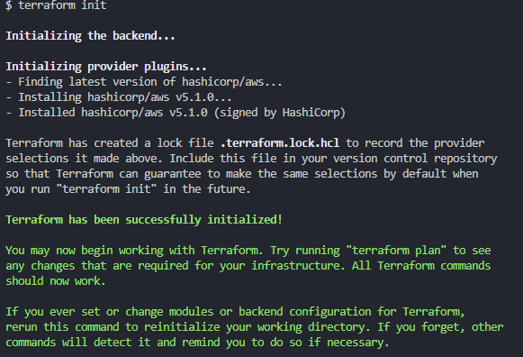
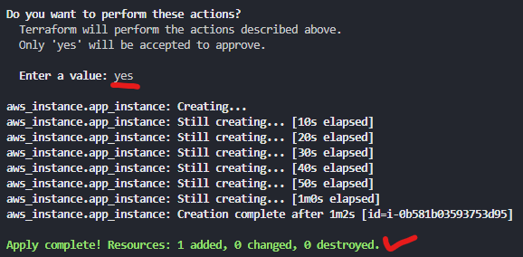

# Terraform

```java

# To create a service on AWS cloud
# Launch an EC2 in Ireland
# Terraform to download required packages/dependencies.
# terraform init

provider "aws" {      
# which region of AWS
        region = "eu-west-1"
}

#gitbash must have admin access
# Launch an EC2

#Which resource - 
resource "aws_instance" "tech230-basil-instance" {

# which AMI - ubuntu 18.04
	ami = "ami-00e8ddf087865b27f"

# type of instance t2.micro
	instance_type = "t2.micro"

# do you need public ip = yes
	associate_public_ip_address = true

# what would you like to call it
	tags = {
		Name = "tech230-basil-terraform-app"
	}

}
```




```bash
terraform init
terraform plan
terraform apply
# yes
terraform destroy
```


```bash
# Provider block specifying the AWS provider and the region
provider "aws" {
	region = "eu-west-1"
}

# Resource block creating an AWS VPC
resource "aws_vpc" "tech230-basil-terraform-vpc" {
	cidr_block = "10.0.0.0/16"
	tags = {
		Name = "tech230-basil-terraform-vpc"
	}
}

# Resource block creating an AWS internet gateway attached to the VPC
resource "aws_internet_gateway" "tech230-basil-terra-IGW" {
	vpc_id = aws_vpc.tech230-basil-terraform-vpc.id
	tags = {
		Name = "tech230-basil-terra-IGW"
	}
}

# Resource block creating a public subnet within the VPC
resource "aws_subnet" "tech230-basil-app-public-subnet" {
	vpc_id            = aws_vpc.tech230-basil-terraform-vpc.id
	cidr_block        = "10.0.2.0/24"
	availability_zone = "eu-west-1a"
	map_public_ip_on_launch = true
	tags = {
		Name = "tech230-basil-app-public-subnet"
	}
}

# Resource block creating a private subnet within the VPC for databases
resource "aws_subnet" "tech230-basil-DB-private-subnet" {
	vpc_id            = aws_vpc.tech230-basil-terraform-vpc.id
	cidr_block        = "10.0.3.0/24"
	availability_zone = "eu-west-1a"
	tags = {
		Name = "tech230-basil-DB-private-subnet"
	}
}

# Resource block creating a route table for the VPC
resource "aws_route_table" "tech230-basil-terra-Public-RT" {
	vpc_id = aws_vpc.tech230-basil-terraform-vpc.id
	route {
    	cidr_block = "0.0.0.0/0"
   		gateway_id = aws_internet_gateway.tech230-basil-terra-IGW.id
  	}
	tags = {
		Name = "tech230-basil-terra-Public-RT"
	}
}

# Resource block associating the route table with the public subnet
resource "aws_route_table_association" "tech230-basil-terra-rt-A" {
  route_table_id = aws_route_table.tech230-basil-terra-Public-RT.id
  subnet_id      = aws_subnet.tech230-basil-app-public-subnet.id
}

# Resource block defining a route in the route table to route all traffic to the internet gateway
resource "aws_route" "tech230-basil-route" {
	route_table_id         = aws_route_table.tech230-basil-terra-Public-RT.id
	destination_cidr_block = "0.0.0.0/0"
	gateway_id             = aws_internet_gateway.tech230-basil-terra-IGW.id
}

# Resource block creating a security group for application instances
resource "aws_security_group" "tech230-basil-terra-VPC-app-SG-80-22" {
	name        = "tech230-basil-terra-VPC-app-SG-80-22"
	description = "Allow SSH and HTTP traffic"
	vpc_id      = aws_vpc.tech230-basil-terraform-vpc.id
	tags = {
		Name = "tech230-basil-terra-VPC-app-SG-80-22
	ingress {
		from_port   = 22
		to_port     = 22
		protocol    = "tcp"
		cidr_blocks = ["0.0.0.0/0"]
	}

	# Ingress rule to allow HTTP traffic
	ingress {
		from_port   = 80
		to_port     = 80
		protocol    = "tcp"
		cidr_blocks = ["0.0.0.0/0"]
	}
}

# Resource block creating a security group for database instances
resource "aws_security_group" "tech230-basil-terra-VPC-DB-SG-27017" {
	name        = "tech230-basil-terra-VPC-DB-SG-27017"
	description = "Allow MongoDB traffic on 27017"
	vpc_id      = aws_vpc.tech230-basil-terraform-vpc.id
	tags = {
		Name = "tech230-basil-terra-VPC-DB-SG-27017"
	}

	# Ingress rule to allow MongoDB traffic on port 27017
	ingress {
		from_port   = 27017
		to_port     = 27017
		protocol    = "tcp"
		cidr_blocks = ["0.0.0.0/0"]
	}
}

# Resource block creating an instance for MongoDB
resource "aws_instance" "tech230-basil-terra-mongodb" {
	ami                    = "ami-09f9939f0890cfe4d"
	instance_type          = "t2.micro"
	vpc_security_group_ids = [aws_security_group.tech230-basil-terra-VPC-DB-SG-27017.id]
	subnet_id              = aws_subnet.tech230-basil-DB-private-subnet.id
	tags = {
		Name = "tech230-basil-terra-mongodb"
	}
	private_ip    = "10.0.3.10"
}

# Resource block adding a time delay before proceeding to the next step
resource "time_sleep" "wait" {
  depends_on = [aws_instance.tech230-basil-terra-mongodb]

  create_duration = "30s"
}

# Resource block creating an instance for the application
resource "aws_instance" "tech230-basil-terra-app" {
	ami                    = "ami-0136ddddd07f0584f"
	instance_type          = "t2.micro"
	vpc_security_group_ids = [aws_security_group.tech230-basil-terra-VPC-app-SG-80-22.id]
	subnet_id              = aws_subnet.tech230-basil-app-public-subnet.id
	associate_public_ip_address = true
	key_name      = "tech230"
	tags = {
		Name = "tech230-basil-terra-app"
	}
	
	# User data script to configure the instance
	user_data = <<-EOF
    #!/bin/bash


	
  EOF
}
```